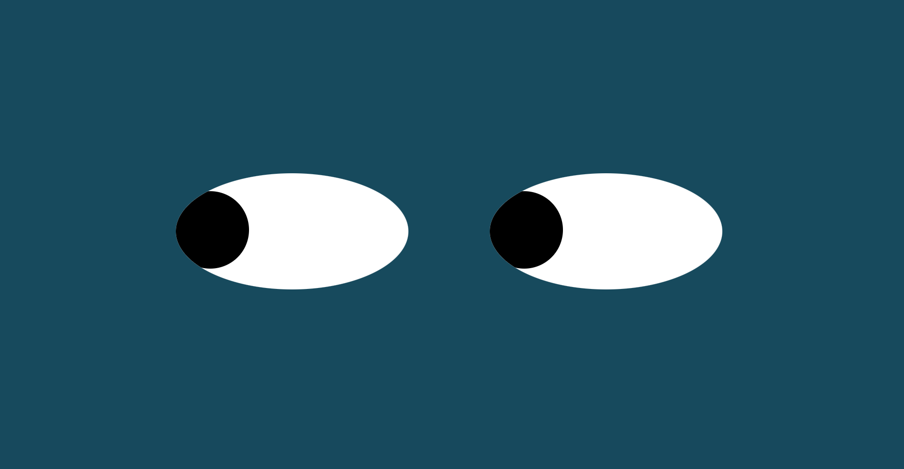

# Eyes
## Eyes Excercise

This excercise uses html, css, and javascript to create a dynamic page where the eyes rendered will respond via the mouseover function, resulting in eye movement that follows the users mouse movement.  

